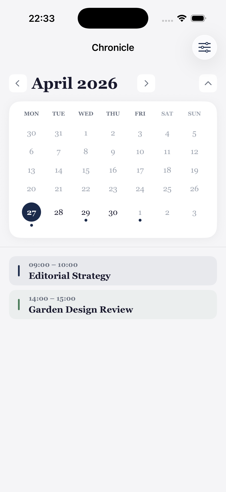
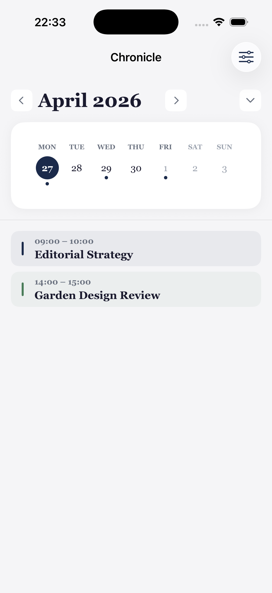
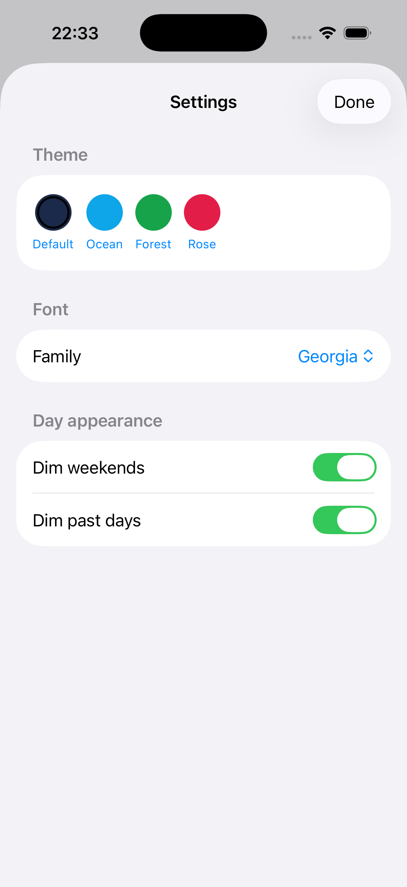

# CustomizableCalendar

A lightweight SwiftUI calendar component for iOS. Drop it in, pass a binding for the selected date, and configure every visual detail — colors, fonts, spacing, and more — through a single `CalendarConfiguration` value.

---

## Preview

<p align="center">
  
  &nbsp;&nbsp;
  
  &nbsp;&nbsp;
  
</p>

---

## Features

- **Month view** — full grid with Monday-first layout, today highlight, selected-day ring, and optional event-indicator dots
- **Week view** — swipeable horizontal week strip (±2 years)
- **Expand / collapse** — single chevron tap animates between month and week
- **Event indicators** — pass a `Set<Date>` of highlighted dates; the library stays event-model-agnostic
- **Live theming** — swap `CalendarConfiguration` at runtime to change colors, font family, spacing, and corner radii instantly
- **Locale-aware weekday headers** — picks up the device language automatically, or accepts a custom 7-symbol override
- **Accessibility** — respects Dynamic Type via the configurable type scale
- **Zero dependencies** — pure SwiftUI, no third-party packages

---

## Requirements

| | Minimum |
|---|---|
| iOS | 17.0 |
| macOS | 14.0 |
| Swift | 5.9 |
| Xcode | 15.0 |

---

## Installation

### Swift Package Manager

**Xcode:** File → Add Package Dependencies, paste the URL below, select *Up to Next Major Version* from `1.0.0`.

```
https://github.com/wnifirami/CustomizableCalendar.git
```

**Package.swift:**

```swift
dependencies: [
    .package(url: "https://github.com/wnifirami/CustomizableCalendar.git", from: "1.0.0")
],
targets: [
    .target(name: "YourApp", dependencies: ["CustomizableCalendar"])
]
```

---

## Quick start

```swift
import SwiftUI
import CustomizableCalendar

struct ContentView: View {
    @State private var selectedDate = Date()

    var body: some View {
        CalendarView(selectedDate: $selectedDate)
    }
}
```

When the user taps a day, `selectedDate` updates automatically.

---

## Event indicators

The library is event-model-agnostic. Pass any `Set<Date>` of **start-of-day** dates and the calendar renders a dot on those days.

```swift
// Your app's event map — any shape you like
let events: [Date: [MyEvent]] = ...

CalendarView(
    selectedDate: $selectedDate,
    highlightedDates: Set(events.keys)   // start-of-day dates
)
```

---

## Configuration

Every visual property comes from `CalendarConfiguration`. Start from `.default` and mutate only what you need.

```swift
var config = CalendarConfiguration.default
config.colors.primary        = Color(hex: "#6B21A8")
config.colors.todayHighlight = Color(hex: "#6B21A8")
config.colors.accent         = Color(hex: "#A855F7")
config.typography.fontFamily = "Avenir Next"
config.appearance.dimWeekends = true

CalendarView(
    selectedDate: $selectedDate,
    configuration: config,
    highlightedDates: highlightedDates
)
```

Configuration is a value type — assigning a new value to the binding updates the calendar live.

---

## CalendarConfiguration reference

### Colors — `config.colors`

| Property | Default | Description |
|---|---|---|
| `primary` | `#1B2A4A` | Today circle fill and selected-day ring |
| `accent` | `#4A7C59` | Secondary accent |
| `background` | `#F5F5F7` | Full-screen background |
| `surface` | `.white` | Card background |
| `primaryText` | `#1A1A2E` | Titles and day numbers |
| `secondaryText` | `#6B7280` | Weekday headers and subtitles |
| `mutedText` | `#9CA3AF` | Out-of-month days and disabled states |
| `todayHighlight` | `#1B2A4A` | Mirrors `primary` by default |

### Typography — `config.typography`

| Property | Default | Description |
|---|---|---|
| `fontFamily` | `"Georgia"` | Applied to every label in the calendar |
| `extraSmall` | `10` | Weekday headers |
| `small` | `12` | Secondary metadata |
| `medium` | `14` | Day numbers |
| `large` | `16` | Card titles |
| `extraLarge` | `20` | Section headers |
| `title` | `28` | Month / year headline |

### Spacing — `config.spacing`

| Property | Default | Description |
|---|---|---|
| `extraSmall` | `4` | Cell internal padding |
| `small` | `8` | Component padding |
| `medium` | `16` | Section padding |
| `large` | `24` | Major gaps |
| `extraLarge` | `32` | Screen-level margins |
| `cornerSmall` | `8` | Small control radius |
| `cornerMedium` | `12` | Toggle / badge radius |
| `cornerLarge` | `20` | Card radius |

### Appearance — `config.appearance`

| Property | Default | Description |
|---|---|---|
| `dimWeekends` | `true` | Renders Saturday and Sunday in muted text |
| `dimPastDays` | `true` | Renders past dates in muted text |
| `weekdaySymbolOverride` | `nil` | Custom 7-symbol array (Mon → Sun); `nil` uses device locale |

---

## CalendarView parameters

| Parameter | Type | Default | Description |
|---|---|---|---|
| `selectedDate` | `Binding<Date>` | — | Currently selected date (required) |
| `configuration` | `CalendarConfiguration` | `.default` | Visual configuration |
| `highlightedDates` | `Set<Date>` | `[]` | Start-of-day dates that show a dot |
| `initialViewMode` | `CalendarViewMode` | `.month` | Opens in `.month` or `.week` mode |

---

## Project structure

```
CustomizableCalendar/
├── Package.swift
├── Sources/CustomizableCalendar/
│   ├── CalendarView.swift              ← public entry point
│   ├── CalendarViewModel.swift         ← internal state & grid math
│   ├── Configuration/
│   │   ├── CalendarConfiguration.swift
│   │   ├── CalendarColors.swift
│   │   ├── CalendarTypography.swift
│   │   ├── CalendarSpacing.swift
│   │   └── CalendarAppearance.swift
│   ├── Models/
│   │   ├── CalendarDay.swift           ← internal grid model
│   │   └── CalendarViewMode.swift      ← public enum
│   ├── Views/
│   │   ├── MonthCalendarView.swift     ← internal
│   │   ├── WeekCalendarView.swift      ← internal
│   │   └── Components/
│   │       ├── DayCellView.swift       ← internal, equatable for perf
│   │       └── ViewToggleView.swift    ← internal
│   └── Helpers/
│       ├── Color+Hex.swift
│       ├── DateFormatter+Cached.swift
│       ├── WeekdaySymbolResolver.swift
│       └── Array+Safe.swift
├── Example/
│   ├── ExampleApp.swift
│   └── ContentView.swift              ← full demo: events, settings sheet, themes
└── CustomizableCalendarTests/
    ├── CalendarViewModelTests.swift
    ├── CalendarConfigurationTests.swift
    └── WeekdaySymbolResolverTests.swift
```

---

## Running the example

Open `CustomizableCalendar.xcodeproj` in Xcode 15+, select the **CustomizableCalendar** scheme, and run on an iOS 17+ simulator.

The example app shows:
- `CalendarView` wired to a live `selectedDate` binding
- Per-day event list driven by the app's own event model
- A settings sheet demonstrating live configuration changes (theme presets, font picker, toggles)

---

## License

MIT — see [LICENSE](LICENSE).

© 2026 Rami Ounifi
